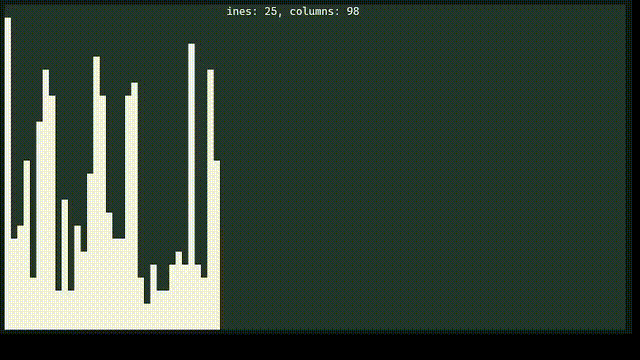

# Nsort

Sort visualizer ncurses based. Educational implementation of sorting algorithms in plain C language.

## Compilation

To compile this program you need `gcc`, `ncurses` and `make`. A `makefile` is provided.

```sh
make
```

```sh
./bin/nsort --help
```

## Quick Sort


## Merge Sort


## Selection Sort


## Shell Sort


## Bubble Sort


